<p align="center">  </p>

## *TinyLoad v7.3 - PE packer and crypter for windows* 
<p align="left">
  <a href="https://github.com/iamsopotatoe-coder/TinyLoad/actions/workflows/build.yml"></a>
  <a href="https://github.com/gmh5225/awesome-game-security"></a>
</p>

TinyLoad is an pe crypter/packer for x64 executables it packs an input exe with varying protection layers to prevent it from being reverse engineered. Its 1 single .cpp file and does not have any external dependencies.

## *how it works*

TinyLoad appends your payload to a copy of itself. when the packed exe runs it extracts the payload, decrypts it, and executes it directly in memory without ever writing the original to disk. every time you pack something the VM opcodes are randomly changed and put into 4 independently keyed subtables so no 2 builds are the same.

```mermaid
flowchart TD
    start["pack(in, out, vm, comp, veh, noconsole)"] --> load["loadFile(in) → orig"]
    load --> pe{"MZ + PE00 + Machine 0x8664 + NumberOfSections in 1..96?"}
    pe -->|fail| err["printf error / return false"]
    pe -->|ok| init["pay = orig    flags = 0"]
    
    init --> cdec{"--c ?"}
    cdec -->|yes| lz["flags |= 1<br/>lzPack: WINDOW=0xFFFF  MAXCHAIN=4096<br/>MAXMATCH=258  MINMATCH=3  HSIZE=65536<br/>hash4 = FNV-ish fold * 0x1000193<br/>lazy lookahead la = 1,2<br/>out = uint32le origSz + 8-token flag bytes<br/>match → varint dist, varint len-3"]
    cdec -->|no| vmq
    lz --> vmq{"--vm ?"}

    vmq -->|yes| scatter["flags |= 2<br/>Fisher-Yates 32 slots, scatter NUM_OPS=28<br/>into subtables 4x8, unused stay 0xFF<br/>opmap_enc op = tbl shl 6 OR idx"]
    scatter --> canary["canary corridor n=8, skip first 0x400 of pay<br/>canExp c = pay at off XOR prev"]
    canary --> mkvm["makeVmProgram opmap_enc, key1, key2, canary<br/>key1,key2 ← mt19937_64 TickCount64 XOR QPC<br/>opaque predicates + stream loop + canary mask"]
    mkvm --> venc["vmEncryptPayload  192-bit state<br/>k3 = 0x9E3779B97F4A7C15<br/>ks = uint8((k1 XOR k2) + k3)<br/>b = NOT(b XOR ks)<br/>k1 = rotl64(k1,11) XOR k2<br/>k2 = rotr64(k2,19) + k1 + k3<br/>k3 = k3 * phi XOR k1"]
    vmq -->|no| vehq
    venc --> vehq{"--veh ?"}

    vehq -->|yes| vflag["flags |= FLAG_VEH 4"]
    vehq -->|no| stub
    vflag --> stub["stub = loadFile GetModuleFileNameA self<br/>saveFile out, stub as host image"]

    stub --> skey["stubKey = 0x9E3779B97F4A7C15<br/>for i in 0x1000 .. min n, 0x2000:<br/>stubKey = (stubKey XOR stub i) * phi"]
    skey --> disp["prime vmRun dispKey=0 → fill g_off<br/>dispKey ← rng<br/>encOff j = uint64(g_off j) XOR dispKey"]

    disp --> tail["Tail: sig TINYLD60, origSz, packSz, flags,<br/>dispOff x28, subtables 4x8, vmCodeSz,<br/>dispKey, canary*, chunk*,<br/>payHash = SHA-256 orig first 8B"]
    tail --> hide["sig i XOR= stubKey shr 8i<br/>xorOpmap FNV-1a 0x811C9DC5 / 0x01000193<br/>feeds origSz, packSz, vmCodeSz + first 32B<br/>of vmCode and pay, per-table<br/>flags |= FLAG_CHUNK 8"]
    hide --> tenc["XOR-encode Tail fields with stubKey slices<br/>vmCode vi XOR= stubKey shr ((vi*3) and 63)"]

    tenc --> ovl["payload = vmCode || pay<br/>interleave: insert 0x00 after every 3 bytes"]
    ovl --> chunks["split into 4 chunks, shuffle physical order<br/>Tail placeholder TAIL_SERIALIZED_SZ = 419<br/>before each chunk: 128..640 RNG junk"]
    chunks --> tea["xxteaEncrypt bytes after Tail<br/>DELTA=0x9E3779B9  rounds=6+52/n<br/>remainder XOR pxKey0 xor pxKey1 xor pxKey2 xor pxKey3<br/>patch k i XOR FEEDF00D / CAFEBABE /<br/>DEADBEEF / 8BADF00D into _pxBlock<br/>between C0DE1337 and B007DEAD"]
    tea --> ser["XOR chunkOff / chunkSz / chunkOrder / chunkCnt<br/>serializeTail: 16 TLV records id + u16le sz + bytes<br/>Fisher-Yates order, LCG 1103515245+12345<br/>seed = stubKey XOR filesize<br/>append DWORD LE: tailOff XOR stubKey low 32"]

    ser --> fin{"--noconsole ?"}
    fin -->|yes| gui["OptionalHeader.Subsystem = IMAGE_SUBSYSTEM_WINDOWS_GUI"]
    fin -->|no| scr
    gui --> scr["scrambleSections: cycle names<br/>.text .data .rdata .bss .idata"]
    scr --> done["saveFile out, result"]
```

<details>
<summary><b>pack() pipeline</b></summary>
  

</details>

## *download*

grab a precompiled binary from [releases](https://github.com/iamsopotatoe-coder/tinyload/releases) or build it yourself.

## *building from source*

you need MinGW (g++). just run:

```cmd
g++ -o TinyLoad.exe TinyLoad.cpp -static -O2 -s
```

or use `build.bat`.

## *usage*

```cmd
TinyLoad.exe --i <input> [--o <output>] [--vm] [--c] [--veh]
```

| flag | what it does |
|------|-------------|
| `--i <file>` | input exe to pack |
| `--o <file>` | output path (default: `input_packed.exe`) |
| `--vm` | VM encryption |
| `--c` | LZ77 compression |
| `--veh` | VEH page fault decryption |
| `--noconsole` | GUI subsystem |

you need at least 1 of `--vm`, `--c`, or `--veh`.

### examples


## *DIE images*

<p align="center">
  
  
</p>


## *compression*

custom LZ77 compression with hash chain matching and a 64KB sliding window. compression runs first, then VM encryption goes on top so any patterns in the compressed data get hidden too.

## *vm encryption*

custom 28 opcode virtual machine that runs inside the stub. the opcodes get randomly placed into 4 subtables of 8 each and every subtable is XOR encrypted with a different key derived from the payload data. cracking 1 subtable reveals at most 8 opcodes out of 28. the cipher itself is a 128 bit stream cipher using rotl and rotr key mixing run entirely inside the VM interpreter. The payload is encrypted using XXTEA.


## *veh page fault decryption*

with `--veh` enabled, all PE section pages get mapped as PAGE_NOACCESS. when the program tries to access a page it triggers an exception, a vectored exception handler decrypts just that 1 page and sets the correct protection. a watchdog thread runs in the background and re-encrypts any page that hasnt been touched in 200ms. at any given moment most of your program is still encrypted in memory so memory dumps only capture whatever was recently accessed.


## *anti dump*

the 4 most critical APIs (GetModuleHandleA, GetProcAddress, ExitProcess, VirtualAlloc) get redirected through wrapper functions inside the stub. after the payload is loaded the entire import directory gets zeroed so memory dumps cannot reconstruct the import table.

## *license*

MIT

## *sidenotes*

- There are alot of features that i didnt put into the readme, you can read the code yourself or look at [changelog.md](docs/CHANGELOG.md)
- this works on most files ive tested, if it breaks on yours open an issue and ill look into it
- suggestions and feature ideas go in issues too
- if you use it a star helps alot <3 
- yes AVs flag packers, thats expected. (Currently has 9 detections on virustotal, any file you pack with it gets 9 detections, the content doesnt matter)
- please dont pack malware with this, its intended for legitimate purposes 
